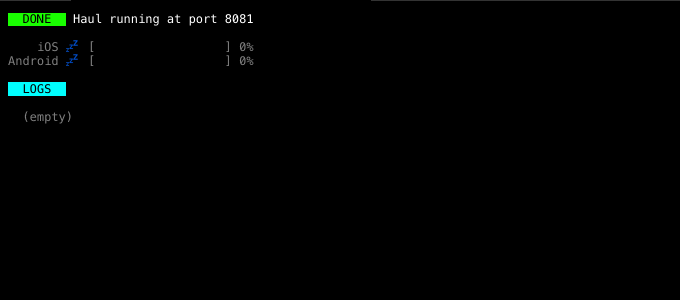

# react-stream-renderer

[![Version][version-badge]][package]
[![Build Status][build-badge]][build]
[![MIT License][license-badge]][license]



Prototype of [Haul CLI](https://github.com/callstack/haul). You can see the [source here](https://github.com/callstack/haul/blob/b5de93c580128a8f5be48c01e4f87211d7e70435/src/server/ui.js#L74-L346).

## Install

```bash
yarn add react-stream-renderer
```

## Usage

```js
import React from 'react';
import { render, View, makeTTYAdapter } from 'react-stream-renderer';

class App extends React.Component {
  render() {
    return (
      <View style={{ color: 'green' }}>
        Hello world!
      </View>
    );
  }
}

render(<App />, makeTTYAdapter(process.stdout).makeEffects());
```

## API
---

## Functions

### `render(element: React.Element, adapter: BaseAdapter): () => void`

Render given element using a given adapter (`makeTTYAdapter` for TTY streams or `makeTestAdapter` for testing purposes).

Returns `forceRender` function which triggers full re-render.

### `makeTTYAdapter(ttyStream: NodeTTYStream): TTYAdapter`

Creates an adapter a TTY Node stream.
Use chainable API from `TTYAdapter` for configuring the behavior:

#### `withCustomConsole(options: OverwriteConsoleOptions): TTYAdapter`

Redirect console output to specified streams or files.

This method won't have any effect unless `makeEffects` is called.

`options: OverwriteConsoleOptions`:

* `exitOnWarning: boolean` - Exit on first call to `console.warning`.
* `exitOnError: boolean` - Exit on first call to `console.error`.
* `outStream: boolean | string | NodeWritableStream` - Redirect console output to:
  * `stdout.log` if `true`
  * custom file if `string` with path is supplied
  * custom Node stream if writable node stream is supplied
* `errStream: boolean | string | NodeWritableStream` - Redirect console error output to:
  * `stderr.log` if `true`
  * custom file if `string` with path is supplied
  * custom Node stream if writable node stream is supplied

#### `hideCursor(): TTYAdapter`

Hides cursor.

This method won't have any effect unless `makeEffects` is called.

#### `clearOnExit(shouldClearScrollback: boolean = false): TTYAdapter`

Clear screen or scrollback (if `shouldClearScrollback` is `true`) when process is about to exit.

This method won't have any effect unless `makeEffects` is called.

#### `clearOnError(): TTYAdapter`

Clear screen (scrollback will be untouched) when process is about to exit due to an error.

This method won't have any effect unless `makeEffects` is called.

#### `makeEffects(): TTYAdapter`

Perform accumulated side effects.
__This method must always be called!__

__Example__

```js
render(
  <View>Hello world</View>,
  makeTTYAdapter(process.stdout)
    .withCustomConsole({ outStream: true, errStream: true })
    .hideCursor()
    .clearOnExit(true)
    .makeEffects()
);
```

### `makeTestAdapter(options: Options): TestAdapter`

Creates an adapter for testing. You can provide hooks to assert the rendered content.

#### `options: Options` 

* `height: number = 40` - Canvas height (default: `40`)
* `width: number = 80` - Canvas width (default: `80`)
* `onPrint?: (data: string) => void` - Testing hook executed on each render, `data` will be a string with full rendered content.
* `onClear: () => void` - Testing hook executed when canvas should be cleared.
* `onSetCursorPosition: (x: number, y: number) => void`- Testing hook executed when cursor should be changed.

#### Example

```js
test('render should draw content', () => {
  const onDraw = jest.fn();
  const adapter = makeTestAdapter({ onDraw });

  render(<View>Test</View>, adapter);

  expect(onDraw).toHaveBeenCalledWith('Test');
});
```

## Components

### `View` (aka `Text`)

Basic building block. Can render text (strings), arrays and other nested components.

`Text` component is exposed for compatibility and it's the same as `View`.

#### Props

* `style?: Style` - Object with [Style properties](#style-properties)

#### Example

```js
class App extends React.Component {
  render() {
    return (
      <View>
        <View style={styles.title}>Hello world!</View>
        Today is {new Date().toLocaleString()}
      </View>
    );
  }
}

const styles = {
  title: {
    margin: '0 1',
    color: 'green',
  },
};
```


### `KeyPress`

Attach `onPress` callback to `keypress` event. __This component by itself doesn't render anything, but it can render passed `children`.__

#### Props

* `stream: ReadableStream` - (Node) Readable stream to read `keypress` events from.
* `onPress(char: string, key: Key): void` - Callback to attach to `keypress` events.
  ```js
  type Key = {
    name: string,
    ctrl: boolean,
    shift: boolean,
    alt: boolean,
  };
  ```

#### Example

```js
import React from 'react';
import { KeyPress, Text } from 'react-stream-renderer';

class MyComponent extends React.Component {
  _onPress = (char, key) => {
    console.log(char, key);
  }

  render() {
    return (
      <KeyPress stream={process.stdin} onPress={this._onPress}>
        <Text>Hello Wolrd!</Text>
      </KeyPress>
    );
  }
}
```

### `ProgressBar`

Uncontrolled component with progress bar. 

#### Props

* `value: number` - Progress value normalized between 0 and 1 (__values above 1 will be treated as 1__).
* `barWidth: number` - Width of progress bar including `open` and `close` characters.
* `chars?: Chars` - Characters and their styling to use when rendering progress bar.
  ```js
  type CharProps = {
    char?: string,
    style?: Style,
  };

  type Chars = {
    open?: CharProps, // default char: '['
    close?: CharProps, // default char: ']'
    bar?: CharProps, // default char: '='
    fill?: CharProps, // default char: ' '
  };
  ```
* `style?: Style` - Object with [Style properties](#style-properties)

#### Example

```js
import React from 'react';
import { ProgressBar, Text } from 'react-stream-renderer';

class MyComponent extends React.Component {
  render() {
    return (
      <Text>
        <ProgressBar
          value={0.4}
          barWidth={40}
          chars={{
            bar: { char: '#' },
            fill: { char: '-' },
            open: { style: { color: 'blue' } },
            close: { style: { color: 'blue' } },
          }}
        />
        {' Some progress'}
      </Text>
    );
  }
}
```

### `Spinner`

Controlled spinner component based on [`cli-spinners`](https://github.com/sindresorhus/cli-spinners).

#### Props

* `type?: string` - [`cli-spinners`](https://github.com/sindresorhus/cli-spinners)'s type (default: `dots`).
* `interval?: number` - Interval between rendering next spinner frames (be default it is taken from specific [`cli-spinners`](https://github.com/sindresorhus/cli-spinners) animation).
* `frames?: string[]` - Custom animation frames.
* `style?: Style` - Object with [Style properties](#style-properties)

#### Example

```js
import React from 'react';
import { Spinner, Text } from 'react-stream-renderer';

class MyComponent extends React.Component {
  render() {
    return (
      <Text>
        <Spinner />
        <Spinner type="line" />
        <Spinner interval={250} />
        <Spinner interval={80} frames={['-', '|', '_', '|']} />
      </Text>
    );
  }
}
```

## Styling and layout


### Layout

#### Positioning

`react-stream-renderer` supports both relative (__default__) and fixed positioning of elements. Use `position: 'fixed'` (and optionally `zIndex`, `left` and `right`) to
make the element fixed to specific position.

#### Display (block vs inline)

`react-stream-renderer` supports both `block` and `inline` display of elements.
By default all `<Text>` components have `display: 'block'` set, whereas all _inline_ text (usually strings) have `display: inline`.

Example:

```js
<Text>A</Text>
<Text>B</Text>
```

renders:

```
A
B
```

but both

```js
<Text>A</Text>
{'B'}
```

and:

```js
<Text style={{ display: 'inline' }}>A</Text>
<Text style={{ display: 'inline' }}>B</Text>

```

renders:

```
AB
```

### Style properties

`react-stream-renderer` supports every color that [`chalk`](https://github.com/chalk/chalk) does.

```js
type Style = {|
  color?: string, // eg: `blue`, `rgb(255, 124, 77)`, `#ffffff`
  backgroundColor?: string, // eg: `blue`, `rgb(255, 124, 77)`, `#ffffff`
  fontWeight?: 'bold' | 'normal',
  fontStyle?: 'italic' | 'normal',
  textDecoration?: 'underline' | 'line-through' | 'normal',
  textTransform?: 'none' | 'capitalize' | 'uppercase' | 'lowercase',
  visibility?: 'visible' | 'hidden',
  margin?: string, // <top> <right> <bottom> <left> eg: `2 1 0 3`, `1 2 3`, `2 1`, `1`
  marginTop?: number,
  marginBottom?: number,
  marginLeft?: number,
  marginRight?: number,
  padding?: string, // <top> <right> <bottom> <left> eg: `2 1 0 3`, `1 2 3`, `2 1`, `1`
  paddingTop?: number,
  paddingBottom?: number,
  paddingLeft?: number,
  paddingRight?: number,
  height?: number,
  width?: number,
  display?: 'block' | 'inline',
  border?: string,
  borderStyle?: 'none' | 'solid' | 'double',
  borderColor?: string,
  textAlign?: 'left' | 'center' | 'right',
  zIndex?: number, // supports both  negative, 0 and positive values
  position?: 'relative' | 'fixed',
  left?: number,
  top?: number,
|};
```


<!-- badges -->
[build-badge]: https://img.shields.io/circleci/project/github/zamotany/react-stream-renderer/master.svg?style=flat-square
[build]: https://circleci.com/gh/zamotany/react-stream-renderer
[license-badge]: https://img.shields.io/npm/l/linaria.svg?style=flat-square
[license]: https://opensource.org/licenses/MIT
[version-badge]: https://img.shields.io/npm/v/react-stream-renderer.svg?style=flat-square
[package]: https://www.npmjs.com/package/react-stream-renderer
