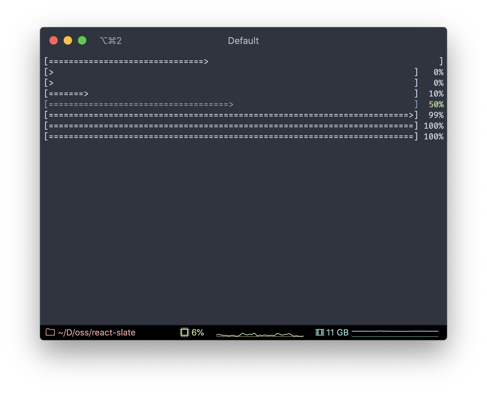

# Progress component

A React component for displaying progress bar.

#### Props:

| Name               | Type                                | Optional | Description                                           |
| ------------------ | ----------------------------------- | :------: | ----------------------------------------------------- |
| `value`            | `number`                            |  __No__  | Value of the progress normalized between `0` and `1`. |
| `percentage`       | `boolean`                           |   Yes    | Whether to display percentage number.                 |
| `renderBar`        | `(children: string) => JSX.Element` |   Yes    | Render prop to stylize the bar.                       |
| `renderPercentage` | `(children: string) => JSX.Element` |   Yes    | Render prop to stylize the percentage number.         |

#### Example:

```js
import React from 'react';
import {View, Text, Progress, render} from '@react-slate/core';

const App = () => (
  <View width="100%" flexDirection="column">
    <Progress value={0.4} />
    <Progress percentage value={-0.1} />
    <Progress percentage value={0} />
    <Progress percentage value={0.1} />
    <Progress
      percentage
      value={0.5}
      renderBar={children => <Text color="blue">{children}</Text>}
      renderPercentage={children => (
        <Text bold color="green">
          {children}
        </Text>
      )}
    />
    <Progress percentage value={0.99} />
    <Progress percentage value={1} />
    <Progress percentage value={1.1} />
  </View>
);

render(<App />);
```

Will render:


