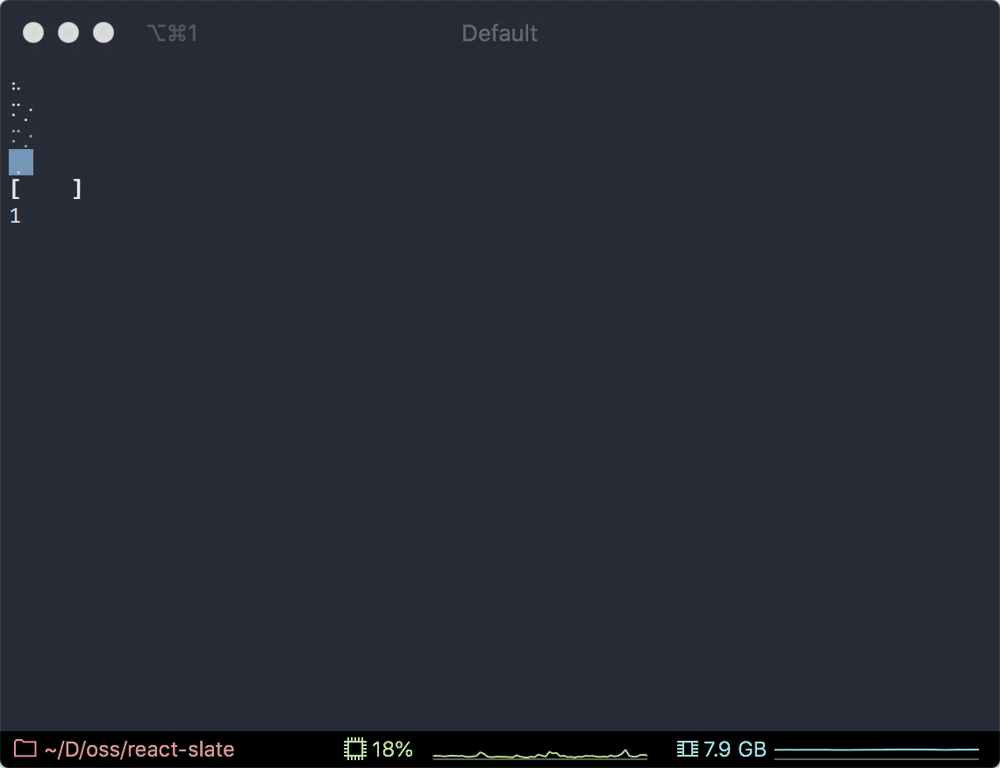

# Spinner component

A React component for displaying activity indicator.

#### Props:

`Spinner` components includes all of the [`Text`](components/text) component props except for `children`.

| Name       | Type                                                                                        | Optional | Description                                                                                                                |
| ---------- | ------------------------------------------------------------------------------------------- | :------: | -------------------------------------------------------------------------------------------------------------------------- |
| `type`     | [`SpinnerName`](https://github.com/sindresorhus/cli-spinners/blob/master/index.d.ts#L2-L72) |   Yes    | Name of the predefined spinner from [cli-spinners](https://www.npmjs.com/package/cli-spinners).                            |
| `interval` | `number`                                                                                    |   Yes    | Custom delay between frames of the spinner.                                                                                |
| `frames`   | `string[]`                                                                                  |   Yes    | Custom frames to used for spinner instead of the predefined ones. If used, **the `interval` prop must also be specified**. |
| `paused`   | `boolean`                                                                                   |   Yes    | Whether the spinner should be paused or spinning.                                                                          |

#### Example:

```js
import React from 'react';
import {View, Spinner, render} from '@react-slate/core';

const App = () => (
  <View flexDirection="column">
    <Spinner />
    <Spinner type="dots12" />
    <Spinner type="dots12" color="green" />
    <Spinner type="dots12" paused bgColor="blue" />
    <Spinner type="bouncingBar" interval={200} bold />
    <Spinner frames={['1', '2', '3']} interval={80} />
  </View>
);

render(<App />);
```

Will render:


