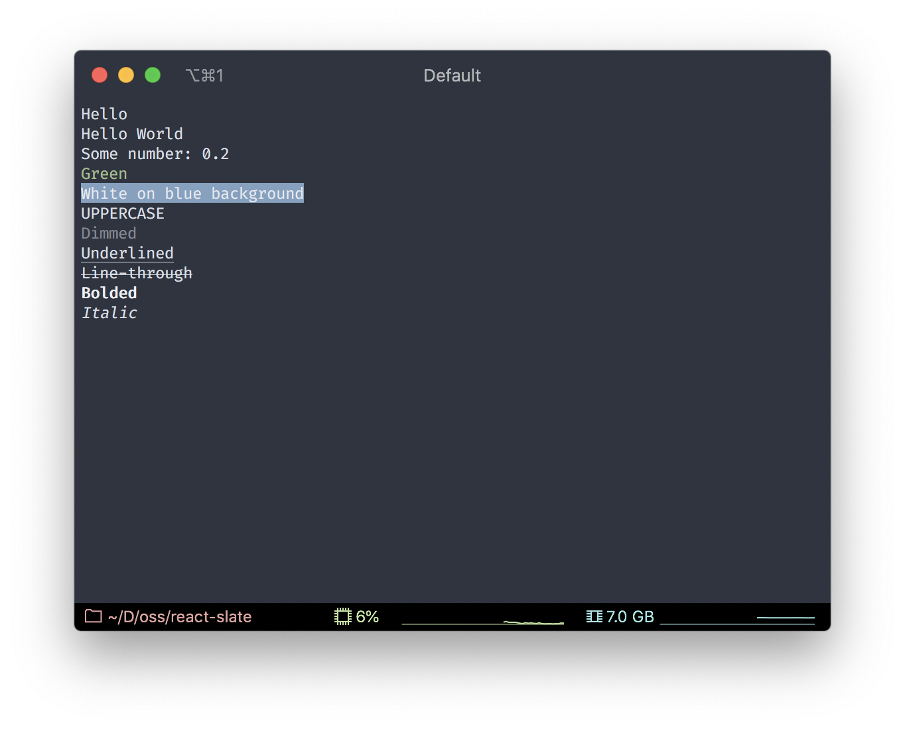

# Text component

A React component for displaying text. All string values should be wrapped in `Text` component.

`Text` components can be nested inside another `Text` to build a styling hierarchy:

```jsx
<Text bold>
  Hello <Text color="green">World</Text>
</Text>
```

will make both `Hello` and `World` bolded and only `World` will be green.

#### Props:

| Name                             | Type                                                | Optional | Description                                                   |
| -------------------------------- | --------------------------------------------------- | :------: | ------------------------------------------------------------- |
| `children`                       | `number \| string \| string[]`                      |  **No**  | Content to render.                                            |
| `color`                          | `string`                                            |   Yes    | Foreground color of the text.                                 |
| `bgColor`                        | `string`                                            |   Yes    | Background color of the text.                                 |
| `textTransform`                  | `'none'` `'capitalize'` `'uppercase'` `'lowercase'` |   Yes    | Transform the text using given capitalization algorithm.      |
| `dim`                            | `boolean`                                           |   Yes    | Makes the text dimmed.                                        |
| `underline`                      | `boolean`                                           |   Yes    | Adds underline to the text.                                   |
| `lineThrough`                    | `boolean`                                           |   Yes    | Add line through the text (strike-through).                   |
| `bold`                           | `boolean`                                           |   Yes    | Makes the text bolded.                                        |
| `italic`                         | `boolean`                                           |   Yes    | Makes the text italic.                                        |
| [`onLayout`](handlers/on-layout) | `(layout: RectData) => void`                        |   Yes    | Function to call once new layout calculated.                  |
| [`onClick`](handlers/on-click)   | `(event: MouseEvent) => boolean \| void`            |   Yes    | Function to call when mouse click is triggered over the text. |
| [`onWheel`](handlers/on-wheel)   | `(event: MouseEvent) => boolean \| void`            |   Yes    | Function to call when mouse click is triggered over the text. |

#### Example:

```jsx
import React from 'react';
import {View, Text, render} from '@react-slate/core';

const App = () => (
  <View flexDirection="column">
    <Text>Hello</Text>
    <Text>{['Hello ', 'World']}</Text>
    <Text>Some number: {0.2}</Text>
    <Text color="green">Green</Text>
    <Text bgColor="blue" color="white">
      White on blue background
    </Text>
    <Text textTransform="uppercase">uppercase</Text>
    <Text dim>Dimmed</Text>
    <Text underline>Underlined</Text>
    <Text lineThrough>Line-through</Text>
    <Text bold>Bolded</Text>
    <Text italic>Italic</Text>
  </View>
);

render(<App />);
```

Will render:


