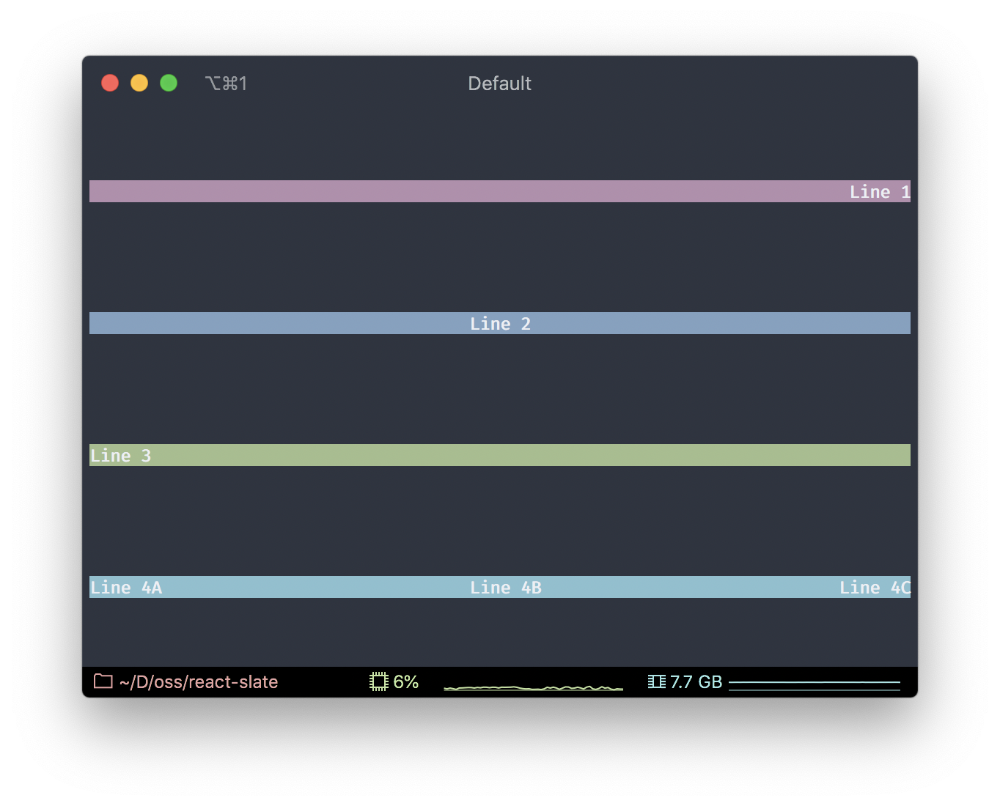

# View component

A React component for organizing content in a layout using Flexbox.

For props with type `number | string`, both numbers (eg `width={100}`) and percentages (eg `width="50%"`) are supported.

#### Props:

| Name             | Type (types)                                                                              | Optional | Description                                                                                                                                                 |
| ---------------- | ----------------------------------------------------------------------------------------- | :------: | ----------------------------------------------------------------------------------------------------------------------------------------------------------- |
| `children`       | `JSX.Element \| JSX.Element[]`                                                            |  **No**  | Content to render.                                                                                                                                          |
| `bgColor`        | `string`                                                                                  |   Yes    | Background color of the view container.                                                                                                                     |
| `position`       | `relative` `absolute`                                                                     |   Yes    | Specify if element should be positioned relatively to it's parent or not.                                                                                   |
| `display`        | `'flex'` `'none'`                                                                         |   Yes    | Display container as a Flexbox or omit the container from being laid out and rendered.                                                                      |
| `flexDirection`  | `'row'` `'row-reverse'` `'column'` `'column-reverse'`                                     |   Yes    | Specify direction of the Flexbox layout.                                                                                                                    |
| `flexWrap`       | `'no-wrap'` `'wrap'` `'wrap-reverse'`                                                     |   Yes    | Specify whether the flexible items should wrap or not.                                                                                                      |
| `flexGrow`       | `number`                                                                                  |   Yes    | Specify how much the item will grow relative to the rest of the flexible items inside the container.                                                        |
| `flexShrink`     | `number`                                                                                  |   Yes    | Specify how much the item will shrink relative to the rest of the flexible items inside the container.                                                      |
| `flexBasis`      | `number \| string`                                                                        |   Yes    | Specify the initial length of a flexible item.                                                                                                              |
| `alignItems`     | `'flex-start'` `'flex-end'` `'center'` `'baseline'` `'stretch'`                           |   Yes    | Specify the default alignment for items inside the container.                                                                                               |
| `alignSelf`      | `'auto'` `'flex-start'` `'flex-end'` `'center'` `'baseline'` `'stretch'`                  |   Yes    | Specify the alignment for the selected item inside the container.                                                                                           |
| `alignContent`   | `'flex-start'` `'flex-end'` `'center'` `'stretch'` `'space-between'` `'space-around'`     |   Yes    | Specify alignment of a flex container's lines within it.                                                                                                    |
| `justifyContent` | `'flex-start'` `flex-end'` `'center'` `'space-between'` `'space-around'` `'space-evenly'` |   Yes    | Align the container's items on the main-axis (horizontally).                                                                                                |
| `marginTop`      | `number \| string`                                                                        |   Yes    | Top margin. Supports percentages.                                                                                                                           |
| `marginRight`    | `number \| string`                                                                        |   Yes    | Right margin. Supports percentages.                                                                                                                         |
| `marginBottom`   | `number \| string`                                                                        |   Yes    | Bottom margin. Supports percentages.                                                                                                                        |
| `marginLeft`     | `number \| string`                                                                        |   Yes    | Left margin. Supports percentages.                                                                                                                          |
| `paddingTop`     | `number \| string`                                                                        |   Yes    | Top padding. Supports percentages.                                                                                                                          |
| `paddingRight`   | `number \| string`                                                                        |   Yes    | Right padding. Supports percentages.                                                                                                                        |
| `paddingBottom`  | `number \| string`                                                                        |   Yes    | Bottom padding. Supports percentages.                                                                                                                       |
| `paddingLeft`    | `number \| string`                                                                        |   Yes    | Left padding. Supports percentages.                                                                                                                         |
| `width`          | `number \| string`                                                                        |   Yes    | Fixed width of the view container, represented in concrete values or percentage of parent's width.                                                          |
| `height`         | `number \| string`                                                                        |   Yes    | Fixed height of the view container, represented in concrete values or percentage of parent's height.                                                        |
| `minWidth`       | `number \| string`                                                                        |   Yes    | Minimum width of the view container, represented in concrete values or percentage of parent's width.                                                        |
| `minHeight`      | `number \| string`                                                                        |   Yes    | Minimum height of the view container, represented in concrete values or percentage of parent's height.                                                      |
| `maxWidth`       | `number \| string`                                                                        |   Yes    | Maximum width of the view container, represented in concrete values or percentage of parent's width.                                                        |
| `maxHeight`      | `number \| string`                                                                        |   Yes    | Maximum height of the view container, represented in concrete values or percentage of parent's height.                                                      |
| `top`            | `number \| string`                                                                        |   Yes    | Top offset for container when positioned absolutely.                                                                                                        |
| `right`          | `number \| string`                                                                        |   Yes    | Right offset for container when positioned absolutely.                                                                                                      |
| `bottom`         | `number \| string`                                                                        |   Yes    | Bottom offset for container when positioned absolutely.                                                                                                     |
| `left`           | `number \| string`                                                                        |   Yes    | Left offset for container when positioned absolutely.                                                                                                       |
| `zIndex`         | `number`                                                                                  |   Yes    | Where the element should sit on Z axis. Relative elements will have `zIndex` set to `0`. Unless specified, absolute elements will have `zIndex` set to `1`. |
| `onLayout`       | `(layout: RectData) => void`                                                              |   Yes    | Function to call once new layout calculated.                                                                                                                |
| `onClick`        | `(event: MouseEvent) => boolean \| void`                                                  |   Yes    | Function to call when mouse click is triggered over the text.                                                                                               |

#### Example:

```js
import React from 'react';
import {View, Text, render} from '@react-slate/core';

const App = () => (
  <View
    flexDirection="column"
    height="100%"
    width="100%"
    justifyContent="space-around"
  >
    <View justifyContent="flex-end" width="100%" bgColor="magenta">
      <Text color="white" bold>
        Line 1
      </Text>
    </View>
    <View justifyContent="center" width="100%" bgColor="blue">
      <Text color="white" bold>
        Line 2
      </Text>
    </View>
    <View justifyContent="flex-start" width="100%" bgColor="green">
      <Text color="white" bold>
        Line 3
      </Text>
    </View>
    <View justifyContent="space-between" width="100%" bgColor="cyan">
      <Text color="white" bold>
        Line 4A
      </Text>
      <Text color="white" bold>
        Line 4B
      </Text>
      <Text color="white" bold>
        Line 4C
      </Text>
    </View>
  </View>
);

render(<App />);
```

Will render:


