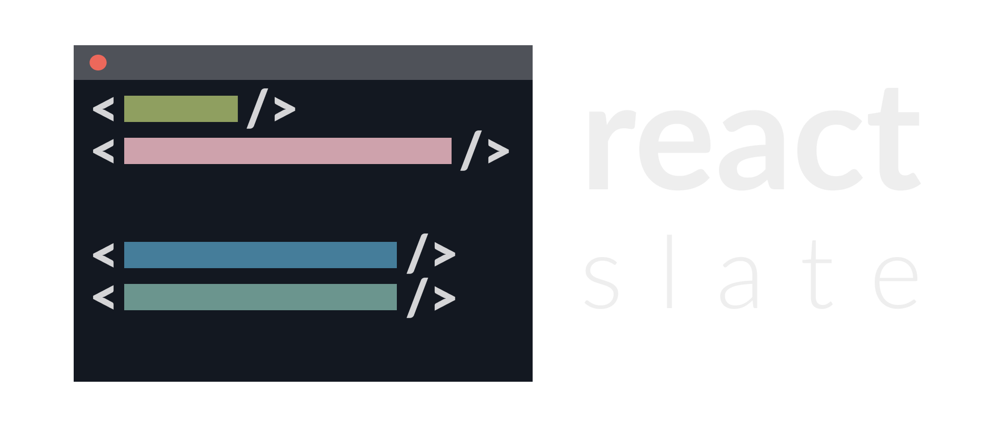

<p align="center">
  
</p>

<p align="center">
  Write interactive CLI apps with React
</p>

---

[![Build Status][build-badge]][build]
[![MIT License][license-badge]][license]

[](#contributors)
[![PRs Welcome][prs-welcome-badge]][prs-welcome]
[![Chat][chat-badge]][chat]
[![Code of Conduct][coc-badge]][coc]

[![tweet][tweet-badge]][tweet]

| Package             | Description                       | Version                                                          |
| ------------------- | --------------------------------- | ---------------------------------------------------------------- |
| `@react-slate/core` | The core functionality and logic. | [![Version][react-slate-core-version]][react-slate-core-package] |

---

### Features

* Render React apps to:
  * terminal with [`render`](api/render)
  * terminal in fullscreen mode with [`renderFullscreen`](api/render-fullscreen)
  * a string with [`renderToString`](api/render-to-string)
  * a JSON tree [`renderToJson`](api/render-to-json)
* Use `for await` to continuously render your app using [`renderToString`](api/render-to-string) or [`renderToJson`](api/render-to-json).
* Render your app to alternative screen buffer and go back to the previous content upon exit with [`renderFullscreen`](api/render-fullscreen).
* Log messages to main screen buffer with `console` when exiting when in fullscreen mode ([`renderFullscreen`](api/render-fullscreen)).
* Build layouts with FlexBox (https://github.com/vislyhq/stretch).
* Disable colors with [`NO_COLOR`](https://no-color.org/) environment variable.
* Use standard ANSI colors, RBG, Hex and CSS keywords to style your app.
* Use built-in [`<Progress />`](components/progress) and [`<Spinner />`](components/spinner) components.
* Get layout information using [`onLayout`](handlers/on-layout) prop.
* Handle clicks using [`onClick`](handlers/on-click) prop.
* Detect mouse wheel events using [`onWheel`](handlers/on-wheel) prop.
* Support for absolute positioning and depth (`zIndex`).
* Built with TypeScript.

Please check out [Roadmap](https://github.com/zamotany/react-slate/issues/99) for in-progress and planned features. 

### Limitations

* Web components are not compatible.
* Strings must be wrapped in a `<Text>` component.

## Installation

```bash
yarn add react @react-slate/core
```

## Usage

```jsx
import React from 'react';
import { render, View, Text } from '@react-slate/core';

function App() {
  return (
    <View width="100%" flexDirection="row" justifyContent="center">
      <Text color="green" bold>Hello world!</Text>
    </View>
  );
}

render(<App />);
```

<!-- badges (common) -->

[build-badge]: https://img.shields.io/circleci/project/github/zamotany/react-slate/master.svg?style=flat-square
[build]: https://circleci.com/gh/zamotany/react-slate
[license-badge]: https://img.shields.io/npm/l/react-slate.svg?style=flat-square
[license]: https://opensource.org/licenses/MIT
[prs-welcome-badge]: https://img.shields.io/badge/PRs-welcome-brightgreen.svg?style=flat-square
[prs-welcome]: http://makeapullrequest.com
[coc-badge]: https://img.shields.io/badge/code%20of-conduct-ff69b4.svg?style=flat-square
[coc]: https://github.com/zamotany/react-slate/blob/master/CODE_OF_CONDUCT.md
[chat-badge]: https://img.shields.io/badge/chat-discord-brightgreen.svg?style=flat-square&colorB=7289DA&logo=discord
[chat]: https://discord.gg/zwR2Cdh
[tweet-badge]: https://img.shields.io/badge/tweet-react--slate-blue.svg?style=flat-square&colorB=1DA1F2&logo=data:image/png;base64,iVBORw0KGgoAAAANSUhEUgAAABgAAAAUCAYAAACXtf2DAAAAAXNSR0IArs4c6QAAAaRJREFUOBGtlM8rBGEYx3cWtRHJRaKcuMtBSitxkCQ3LtzkP9iUUu5ODspRHLhRLtq0FxeicEBC2cOivcge%2FMgan3fNM8bbzL4zm6c%2BPT%2Fe7%2FO8887svrFYBWbbtgWzsAt3sAcpqJFxxF1QV8oJFqFPFst5dLWQAT87oTgPB7DtziFRT1EA4yZolsFkhwjGYFRO8Op0KD8HVe7unoB6PRTBZG8IctAmG1xrHcfkQ2B55sfI%2ByGMXSBqV71xZ8CWdxBxN6ThFuECDEAL%2Bc9HIzDYumVZ966GZnX0SzCZvEqTbkaGywkyFE6hKAsBPhFQ18uPUqh2ggJ%2BUor%2F4M%2F%2FzOC8g6YzR1i%2F8g4vvSI%2ByD7FFNjexQrjHd8%2BnjABI3AU4Wl16TuF1qANGll81jsi5qu%2Bw6XIsCn4ijhU5FmCJpkV6BGNw410hfSf6JKBQ%2FUFxHGYBnWnmOwDwYQ%2BwzdHqO75HtiAMJfaC7ph32FSRJCENUhDHsLaJkL%2FX4wMF4%2BwA5bgAcrZE4sr0Cu9Jq9fxyrvBHWbNkMD5CEHWTjjT2m6r5D92jfmbbKJEWuMMAAAAABJRU5ErkJggg%3D%3D
[tweet]: https://twitter.com/intent/tweet?text=Check%20out%20react-slate!%20https://github.com/zamotany/react-slate%20%F0%9F%91%8D

<!-- badges (packages) -->

[react-slate-core-version]: https://img.shields.io/npm/v/@react-slate/core.svg?style=flat-square
[react-slate-core-package]: https://www.npmjs.com/package/@react-slate/core
