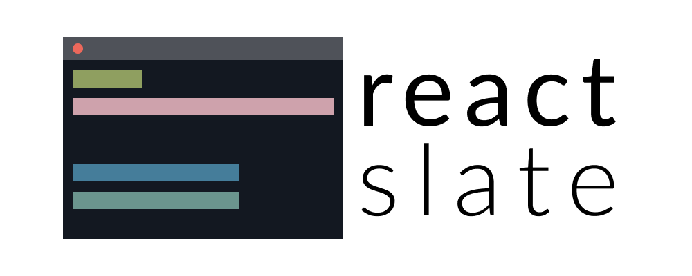

<p align="center">
  
</p>

<p align="center">
  Write React apps for terminal
</p>

---

# `@react-slate/components`

[![Version][version-badge]][package]
[![Build Status][build-badge]][build]
[![MIT License][license-badge]][license]

[![PRs Welcome][prs-welcome-badge]][prs-welcome]
[![Chat][chat-badge]][chat]
[![Code of Conduct][coc-badge]][coc]

Standard component library for [`react-slate`](https://www.npmjs.com/package/@react-slate/core).

---


Prototype of [Haul CLI](https://github.com/callstack/haul). You can see the [source here](https://github.com/callstack/haul/blob/b5de93c580128a8f5be48c01e4f87211d7e70435/src/server/ui.js#L74-L346).

### Installation

```bash
yarn add @react-slate/core @react-slate/components
```

### Documentation

Documentation can be found here: http://react-slate.surge.sh/

<!-- badges -->

[build-badge]: https://img.shields.io/circleci/project/github/zamotany/react-slate/master.svg?style=flat-square
[build]: https://circleci.com/gh/zamotany/react-slate
[license-badge]: https://img.shields.io/npm/l/@react-slate/components.svg?style=flat-square
[license]: https://opensource.org/licenses/MIT
[version-badge]: https://img.shields.io/npm/v/@react-slate/components.svg?style=flat-square
[package]: https://www.npmjs.com/package/@react-slate/components
[prs-welcome-badge]: https://img.shields.io/badge/PRs-welcome-brightgreen.svg?style=flat-square
[prs-welcome]: http://makeapullrequest.com
[coc-badge]: https://img.shields.io/badge/code%20of-conduct-ff69b4.svg?style=flat-square
[coc]: https://github.com/zamotany/react-slate/blob/master/CODE_OF_CONDUCT.md
[chat-badge]: https://img.shields.io/badge/chat-discord-brightgreen.svg?style=flat-square&colorB=7289DA&logo=discord
[chat]: https://discord.gg/zwR2Cdh
